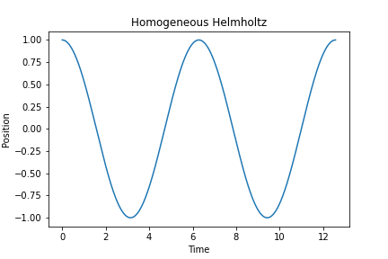
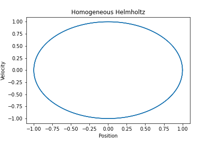
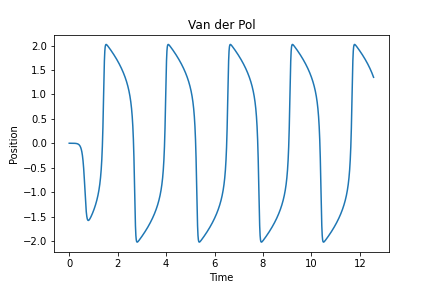
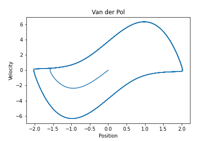
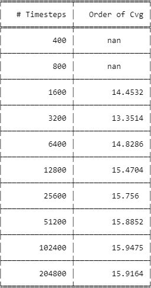

<h3 align="center">Advanced Numerical Analysis HW 1</h3>

  <p align="center">
    Code for solving systems of differential equations via the 4th order Runge-Kutta, Crank-Nicholson, and 2nd order Adams-Bashforth methods. The methods are tested on the simple Cauchy problem, the homogeneous Helmholtz equation, and the Van der Pol oscillator.
  </p>
</div>

<!-- GETTING STARTED -->
## Getting Started

The code requires Python to be installed on the machine.

### Prerequisites

The modules required in Python are
* tabulate
  ```sh
  pip install tabulate
  ```
* numpy
  ```sh
  pip install numpy
  ```
* scipy
  ```sh
  pip install scipy
  ```
* matplotlib
  ```sh
  pip install matplotlib
  ```

### Installation

1. Simply download HW1.py or HW1nb.pynb and run in your favorite Python environment
2. Install required modules

<!-- USAGE EXAMPLES -->
## Usage

#### 4th order Runge-Kutta method on the Cauchy test problem.
The code uses the initial value 1, stops at time T=1, and should print the follow statement after running:
The error for 4th order Runge-Kutta when solving the Cauchy test problem using 1000 timesteps is 5.51e-14

#### Crank-Nicholson method on the Cauchy test problem:
The code uses the initial value 1, stops at time T=1, and should print the follow statement after running:
The error for Crank-Nicholson when solving the Cauchy test problem using 1000 timesteps is 2.27e-07

#### 2nd order Adams-Bashforth method on the Cauchy test problem:
The code uses the initial value 1, stops at time T=1, and should print the follow statement after running:
The error for 2nd order Adams-Bashforth when solving the Cauchy test problem using 1000 timesteps is 2.49e-06

#### 4th order Runge-Kutta method on the Homogeneous Helmholtz equation:
The code runs with an initial position of 1, velocity of 0, stops at time T=4&pi, and should display the following images along with the error statement:
The error for 4th order Runge-Kutta when solving the homogeneous Helmholtz equation using 100 timesteps is 2.43e-05

<a href="https://github.com/Shlorki/NumericalHW1">
  
  
</a>

#### 4th order Runge-Kutta method on the Van der Pol oscillator:
The code runs with an initial position of 10<sup>-3</sup>, velocity of 0, stops at time T=50, has a damping parameter of 4, and should display the following images along with a table providing the order of convergence:

<a href="https://github.com/Shlorki/NumericalHW1">
  
  
</a>

A posteriori order of convergence

<a href="https://github.com/Shlorki/NumericalHW1">
  
</a>
<p align="right">(<a href="#readme-top">back to top</a>)</p>
